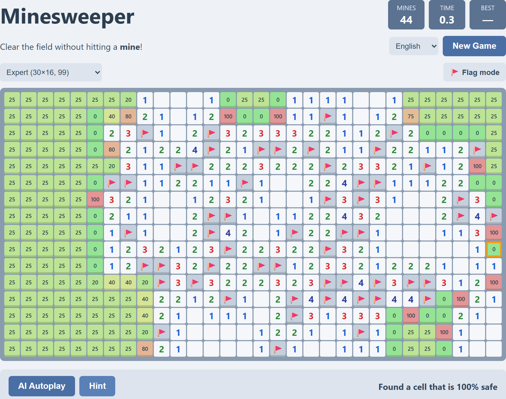

<div align="center">

# Auto-Minesweeper

**Minesweeper in the browser with a probability-based AI that plays for you.**

[](https://mrdadado.github.io/Auto-Minesweeper/)

**Play online: https://mrdadado.github.io/Auto-Minesweeper/**

[](LICENSE)


[](https://github.com/MrDaDaDo/Auto-Minesweeper/stargazers)



<sub>The AI mid-game on Expert, with the mine probability of every covered cell shown</sub>

</div>

A dependency-free browser version of **Minesweeper** with a built-in **AI solver** that can play the game for you, suggest your next move, or show the exact chance that each covered cell hides a mine. Just open the page and hit **AI Autoplay**.

> If you find this project fun or useful, please consider giving it a ⭐ — it really helps!

## Features

- **Classic Minesweeper gameplay**: Beginner, Intermediate, Expert and custom boards; the first click is always safe and opens an area
- **Mouse and touch controls**: left click to open, right click to flag, click a satisfied number to open its neighbors (chording); long press or **Flag mode** on mobile; **F2** for a new game
- **AI Autoplay**: lets the AI play continuously
- **Hint**: highlights the AI's suggested next cell and tells you whether it is certain or a guess
- **Mine probabilities**: overlays the exact mine probability (%) on every covered cell
- **Auto restart + win-rate stats**: let the AI play game after game and track its record per board
- **Multilingual UI**: English, 繁體中文, 简体中文, 日本語, 한국어 (auto-detected from the browser, selection remembered)
- **Best times** and AI stats saved in `localStorage`

## Getting Started

No build step or dependencies are required.

1. Clone the repository:
   ```bash
   git clone https://github.com/MrDaDaDo/Auto-Minesweeper.git
   ```
2. Open `index.html` in a modern browser.

## How the AI Works

Every opened number is a constraint: *the covered cells around it contain exactly (number − flags) mines.* The solver works in three stages:

1. **Simple logic**: if a number's remaining mines is 0, all its covered neighbors are safe; if it equals the number of covered neighbors, they are all mines. This repeats until nothing changes.
2. **Exact probabilities**: the remaining frontier cells are split into independent groups that share no constraint. For each group, a backtracking search enumerates every valid mine layout, counting solutions by how many mines they use.
3. **Global mine count**: the groups are combined by convolution, and each total is weighted by the number of ways to place the leftover mines in the unconstrained interior cells, `C(interior, minesLeft − K)` (computed in log space). This gives the exact probability for every covered cell, frontier and interior alike.

Each AI step flags every cell that is certainly a mine and opens every cell that is certainly safe. Only when nothing is certain does it **guess the cell with the lowest mine probability**, preferring cells with fewer covered neighbors (corners and edges are more likely to open an area) when probabilities tie. If a group is too large to enumerate, it falls back to a local approximation.

### Win rates

Measured over simulated games with the same rules as the page (first click opens a safe 3×3 area):

| Board | Size | Mines | Games | AI win rate |
| --- | --- | --- | --- | --- |
| Beginner | 9×9 | 10 | 5,000 | 95.9% |
| Intermediate | 16×16 | 40 | 1,000 | 88.2% |
| Expert | 30×16 | 99 | 500 | 52.0% |

Losses come from positions where no cell is provably safe and the AI has to guess.

## Project Structure

```
index.html   Page layout and styles
game.js      Game logic, rendering, input and AI controls
solver.js    Logic + exact-probability Minesweeper solver
i18n.js      Translations and language switching
```

## License

Released into the public domain under [The Unlicense](LICENSE).
